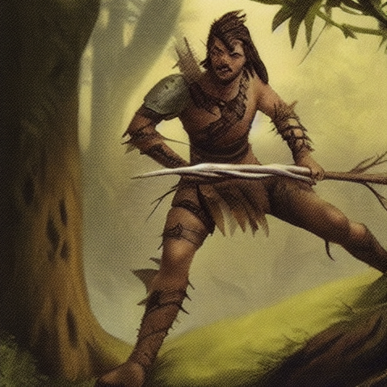

# WARRIOR

## Base collection
| Name | Image | Energy | Description |
| ---- | ----- | ------ | ----------- |
| Arterial Strike | <missing> | 1 | Enemy:  (melee) Add 5 [url]bleed[/url]  |
| Lunge |  | 2 | Attack (melee) enemies in area (2 tiles) for 10 dmg  |
| Rage |  | 1 | Add 1 [url]power[/url]  |
| Shield |  | 1 | Add 8 [url]block[/url]  |
| Shout |  | 1 | Area (9 tiles):  (melee) Add 1 [url]weakness[/url]  |
| Slash |  | 1 | Attack (melee) for 8 dmg  |
| Sweeping Slash |  | 2 | Attack (melee) enemies in area (3 tiles) for 8 dmg  |
| Sword Assault | <missing> | 1 | Attack (melee) for 10 dmg After Play: Draw 1 cards  |

## Unlock Level 1
| Name | Image | Energy | Description |
| ---- | ----- | ------ | ----------- |
| Cleave |  | 1 | Attack (melee) for 10 dmg On Kill: Add 1 AP  |
| Last Stand |  | 1 | Discard your hand Attack (melee) for 5.0x the original number of cards in your hand (-1) dmg  |
| New Plan |  | 1 | Discard your hand, draw the original number of cards in your hand cards  |

## Unlock Level 2
| Name | Image | Energy | Description |
| ---- | ----- | ------ | ----------- |
| Armor Plating | <missing> | 1 | Add 12 [url]block[/url]  |
| Charge | <missing> | 1 | Attack (melee) for the MP used this turn (-1) dmg  |
| Knock Out | <missing> | 1 | Enemy:  (melee) Add 1 [url]paralysis[/url]  |

## Unlock Level 3
| Name | Image | Energy | Description |
| ---- | ----- | ------ | ----------- |
| Improvise |  | 0 | Draw 1 attack cards  |
| Sharp Cut |  | 1 | Attack (melee) for 6 dmg On Damage: Add 2 [url]bleed[/url]  |
| Shield Bash |  | 1 | Attack (melee) for block (-1) dmg  |

## Unlock Level 4
| Name | Image | Energy | Description |
| ---- | ----- | ------ | ----------- |
| Fortify |  | 3 | [url=exhaust]Exhaust[/url]. Power: [url]Permanent Block[/url]  |
| Fury |  | 2 | [url=exhaust]Exhaust[/url]. Power: [url]Fury[/url]  |

