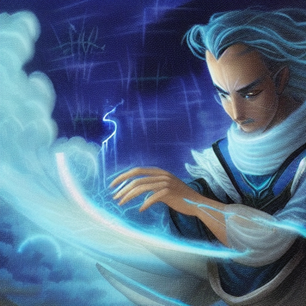
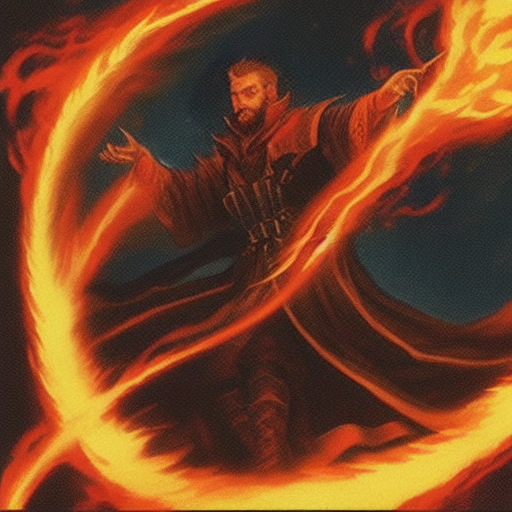
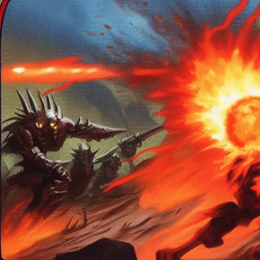
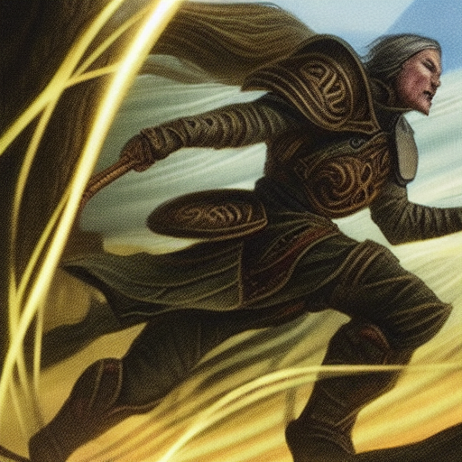
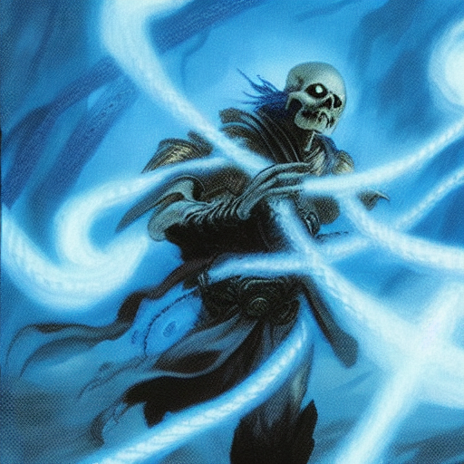
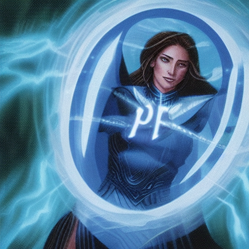
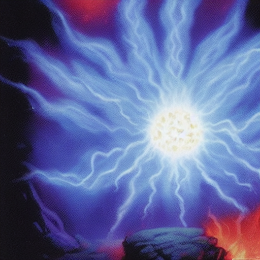
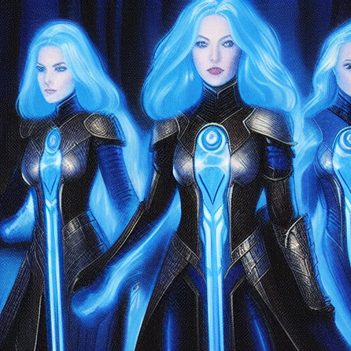
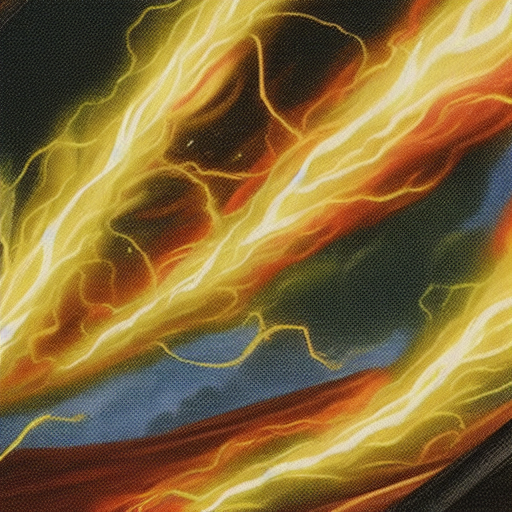
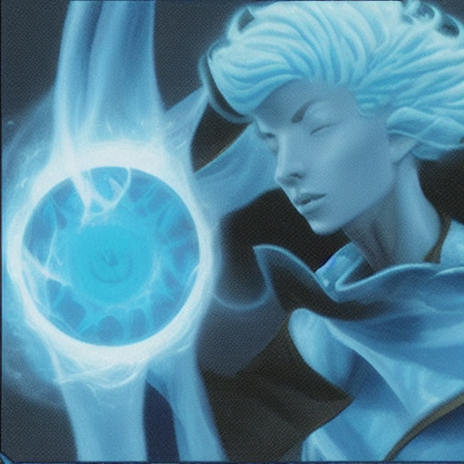

# WIZARD

## Base collection
| Name | Image | Action Cost | Description | Upgrades |
| ---- | ----- | ----------- | ----------- |----------|
| Brainstorm |  | 1 | Self or Ally:  (range 5) Draw 1 cards  | **Instant** Cost: 0 Description: Self or Ally:  (range 5) Draw 1 cards  **Thorough** Cost: 1 Description: Self or Ally:  (range 5) Draw 2 cards  |
| Burning Hands |  | 2 | Attack (melee) enemies in area (4 tiles) for 8 dmg  | **Fiery** Cost: 2 Description: Attack (melee) enemies in area (4 tiles) for 13 dmg  **Wide** Cost: 2 Description: Attack (melee) enemies in area (8 tiles) for 8 dmg  |
| Fireball |  | 2 | Attack (range 5) enemies in area (5 tiles) for 8 dmg  | **Massive** Cost: 2 Description: Attack (range 5) enemies in area (13 tiles) for 8 dmg  **Nova** Cost: 2 Description: Attack (range 5) enemies in area (5 tiles) for 13 dmg  |
| Haste |  | 1 | Self or Ally:  (range 5) Add 1 AP, add 4 *MP*  | **Double** Cost: 1 Description: Add 1 AP, add 4 *MP* Self or Ally:  (range 5) Add 1 AP, add 4 *MP*  **Enduring** Cost: 1 Description: Self or Ally:  (range 5) Add 1 AP, add 4 *MP* Next Turn: Add 1 AP, add 4 *MP*  |
| Hold Enemy |  | 1 | Enemy:  (range 5) Add 1 *paralysis*  | **Drain Energy** Cost: 1 Description: Enemy:  (range 5) Add 1 *paralysis* After Play: Add 1 AP  **Lasting** Cost: 1 Description: Enemy:  (range 5) Add 2 *paralysis*  |
| Magic Missile |  | 1 | Attack (range 5) for 7 dmg  | **Long Range** Cost: 1 Description: Attack (range 7) for 7 dmg  **Powerful** Cost: 1 Description: Attack (range 5) for 10 dmg  |
| Magic Shield |  | 1 | Self or Ally:  (range 6) Add 6 *block*  | **Instant Cast** Cost: 0 Description: Self or Ally:  (range 6) Add 6 *block*  **Powerful** Cost: 1 Description: Self or Ally:  (range 6) Add 9 *block*  |
| Mana Burst |  | 2 | Attack (range 5) enemies in area (5 tiles) for 4.0x the cards played this turn (-1) dmg  | **Fast** Cost: 1 Description: Attack (range 5) enemies in area (5 tiles) for 4.0x the cards played this turn (-1) dmg  **Powerful** Cost: 2 Description: Attack (range 5) enemies in area (5 tiles) for 6.0x the cards played this turn (-1) dmg  |
| Mirror Image |  | 1 | Add 1 *dodge*  | **Blink** Cost: 1 Description: Add 1 *dodge* After Play: Teleport up to 4 tiles  **Protect Ally** Cost: 1 Description: Self or Ally:  (range 5) Add 1 *dodge*  |
| Multicast |  | 1 | Copy an attack card (1 times) New: reduce cost by 1💢, add *Exhaust*   | **Enhancing** Cost: 1 Description: Copy an attack card (1 times) Original: reduce cost by 1💢 New: reduce cost by 1💢, add *Exhaust*   **High Magic** Cost: 2 Description: Copy an attack card (2 times) New: reduce cost by 2💢, add *Exhaust*   |
| Recall Spell |  | 1 | Shuffle discard into deck and pick 1 cards (add *Exhaust*)  | **Focused** Cost: 1 Description: Shuffle discard into deck and pick 1 cards  **Instant** Cost: 0 Description: Shuffle discard into deck and pick 1 cards (add *Exhaust*)  |
| Teleport | missing | 1 | Teleport up to 6 tiles  |  |
